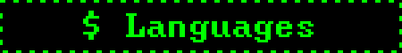
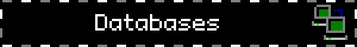
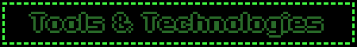
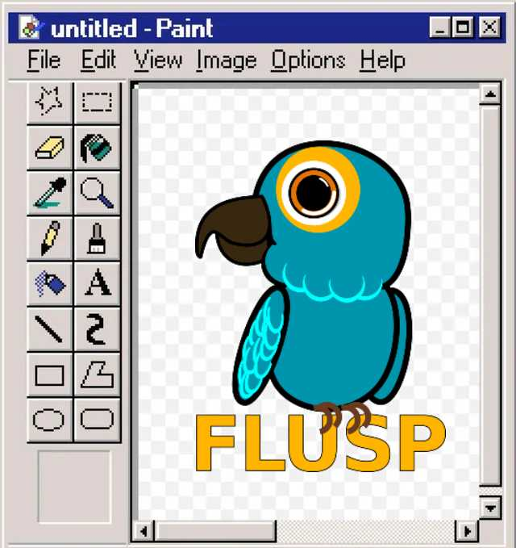
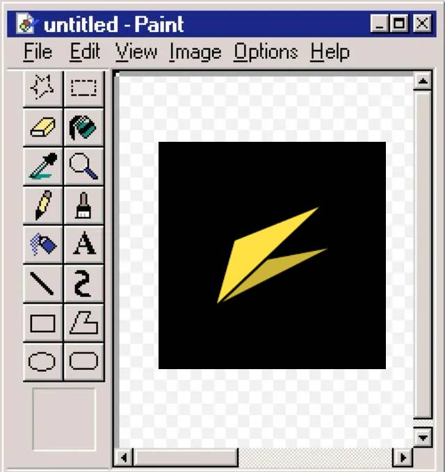

<h3 align="center">
    
  
  
  
   
  

</h3>
<samp>

  

  

</samp>

  

  

### Extension groups

  
  

- **FLUSP** - FLOSS at USP: A group of graduate and undergraduate students at the University of São Paulo (USP) that aims to contribute to free software (Free/Libre/Open Source Software - FLOSS) projects. 
  
- **FEA.dev**: Student association of Fin. Quant. and artificial intelligence (AI) of FEAUSP (School of Economics, Business, Accounting and Actuary/USP)

  

 

- Studant at the **best university** of Latin America and the south hemisphere. **USP**
- **Winner of INTERIF 2024**, a statewide programming marathon, competing against university-level teams.  
- Built projects ranging from **APIs and automation tools** to **web platforms**, **simulators**, and **systems for real users**.  

  
  
  
    
  
  

</samp>
