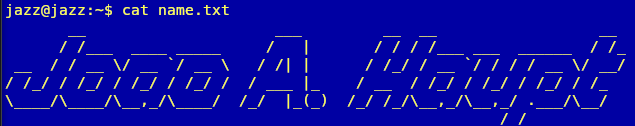
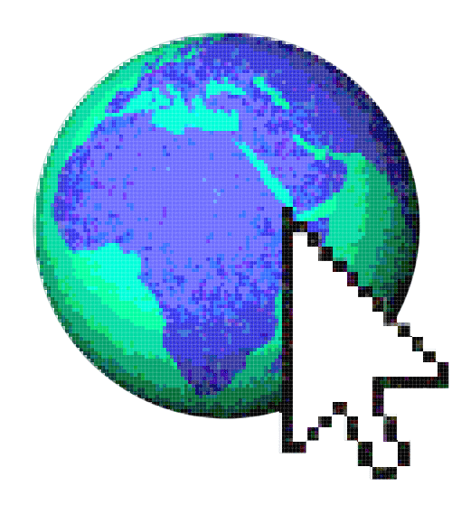

<h3 align="center">
  
  
  
   
  

</h3>
<samp>

</samp>

  
  

### Languages I’ve worked with

### Databases

### Frameworks

### Tools & Technologies

### Operating Systems

  
  

## 🏆 Highlights
- 🥇 **Winner of INTERIF 2024**, a statewide programming marathon, competing against university-level teams.  
- 💻 Built projects ranging from **APIs and automation tools** to **web platforms**, **simulators**, and **systems for real users**.  
- ☕ Strong interest in **Java**, back-end development, algorithms, and system design.

</samp>
